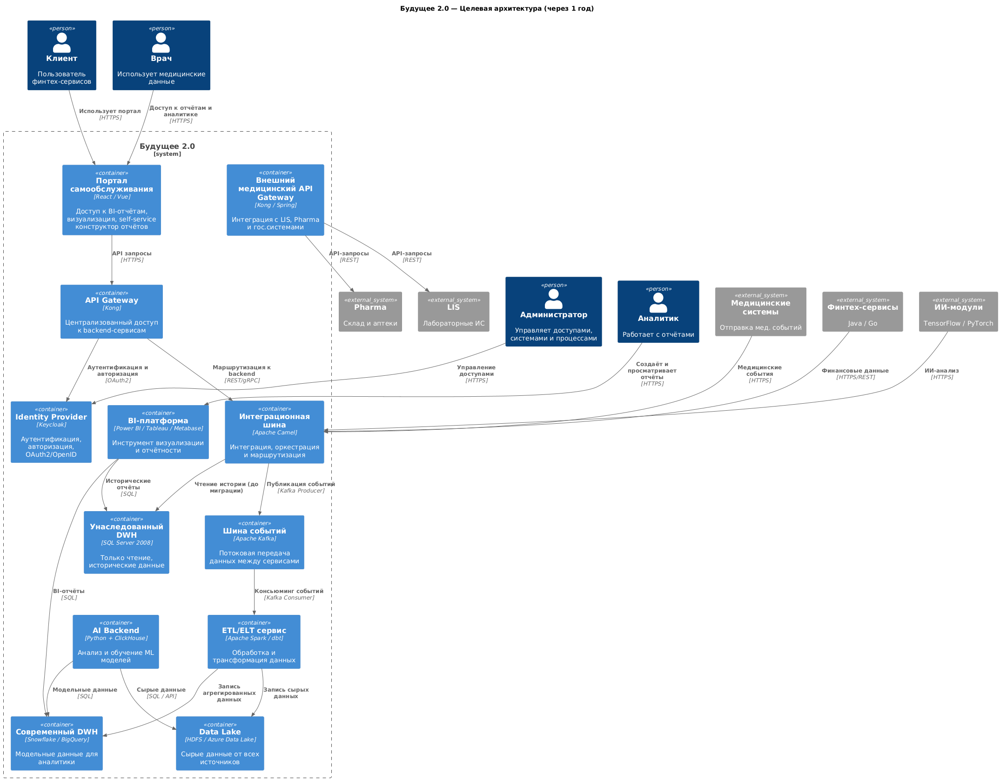

# Архитектура системы «Будущее 2.0» через год (уровень контейнеров)

### Цель

Создать масштабируемую, модульную, интегрированную архитектуру, поддерживающую разные бизнес-направления (медицина, финтех, ИИ, фармацевтика) с возможностью self-service аналитики и быстрой интеграцией новых источников данных.

---

### C4 Container Diagram

---

## Краткое описание архитектуры

| Компонент             | Назначение                                                                                   |
| --------------------- | -------------------------------------------------------------------------------------------- |
| **API Gateway + ESB** | Централизованная маршрутизация и интеграция сервисов (финтех, ИИ, медицина, внешние системы) |
| **Kafka + Spark**     | Реализация потоковой обработки, быстрая реакция на бизнес-события                            |
| **Data Lake + DWH**   | Разделение хранения сырых и структурированных данных, масштабируемость                       |
| **BI-платформа**      | Self-service аналитика, доступ к данным из разных витрин                                     |
| **AI-платформа**      | Отдельная инфраструктура для ML-обработки, с доступом к данным через Data Lake и DWH         |
| **Legacy DWH**        | Исторические данные доступны только для чтения. Постепенный sunset.                          |
| **Keycloak**          | Централизованное управление доступом (RBAC/ABAC) для всех доменов                            |

---

## Проблемные места и приоритезация (по MoSCoW)

| Проблема                               | Описание                                                                                                           | Приоритет       |
| -------------------------------------- | ------------------------------------------------------------------------------------------------------------------ | --------------- |
| **Устаревший DWH**                     | MS SQL 2008 не масштабируется, не поддерживается, имеет встроенную бизнес-логику, замедляет всё.                   | **Must have**   |
| **Сложность интеграции новых систем**  | Добавление новых фарма/электроника-компаний требует ручной работы, нет стандартизированной шины.                   | **Must have**   |
| **Медленная отчётность**               | Текущая архитектура не обеспечивает near real-time отчёты.                                                         | **Must have**   |
| **Отсутствие модульности**             | Бизнесы зависят от одной платформы → узкое горлышко.                                                               | **Must have**   |
| **Ограниченный BI**                    | Power BI требует ручной настройки, нет гибкости.                                                                   | **Should have** |
| **Безопасность данных**                | Хранение чувствительных данных без маскировки и контроля доступа на уровне отчётов.                                | **Must have**   |
| **Устаревшая интеграционная шина**     | Camel нуждается в расширении/модернизации или замене на более современный подход (например, Apache NiFi или gRPC). | **Could have**  |
| **Нет конвейера качества данных (DQ)** | Не проводится автоматическая валидация и очистка данных в потоках.                                                 | **Should have** |

---

## Резюме

Для поддержки развития в разные бизнес-домены и построения сквозной аналитики, **архитектура через год** должна быть:

* модульной (data mesh-подход);
* event-driven;
* с новым DWH и Data Lake;
* с гибкой BI-витриной;
* с централизованной авторизацией;
* с возможностью лёгкой интеграции внешних и дочерних систем.