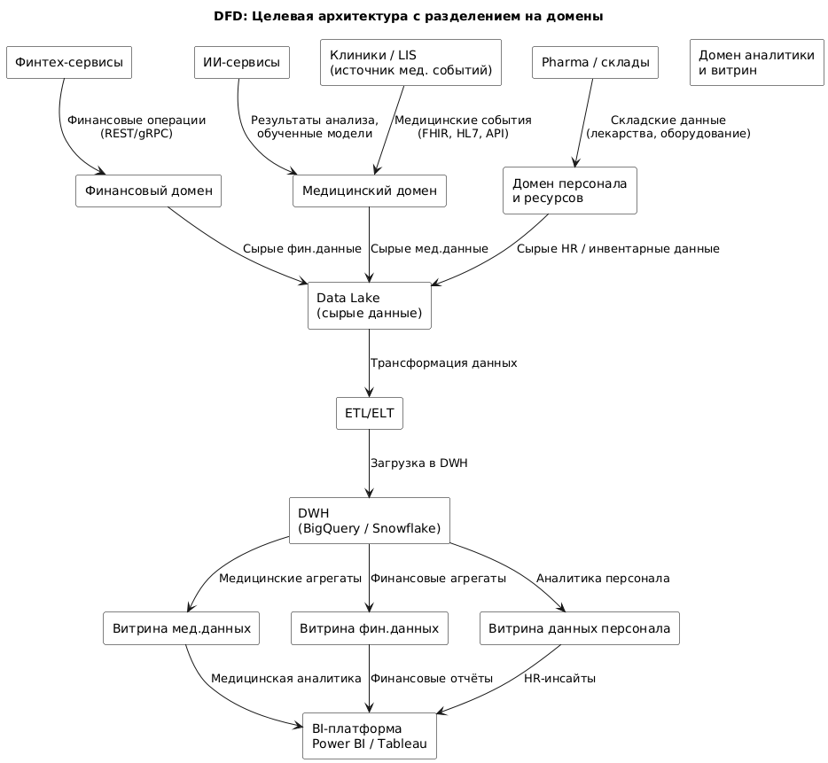

# Домены и архитектура потоков данных

## Разделение системы на бизнес-домены

Для масштабируемого, гибкого и независимого развития компонентов системы предлагается разделение на **четыре стратегических бизнес-домена**, соответствующих основным направлениям деятельности и источникам данных в архитектуре:

---

### **1. Домен “Медицинские данные”**

**Сущности и данные:**

* Пациенты, медицинские карты, результаты лабораторных и инструментальных исследований
* Медицинская история, диагнозы, назначения, обращения

**Компоненты:**

* Внешние клиники и LIS-системы
* Внутренние API, интеграционная шина (ESB)
* Data Lake для хранения сырых мед. данных
* AI-платформа для анализа данных и обучения моделей

**Назначение:**

* Централизованный сбор, хранение и обработка медицинских событий
* Поддержка ИИ-модулей (диагностика, рекомендации)

---

### **2. Домен “Финансовые данные”**

**Сущности и данные:**

* Платежи, счета, фин. операции, кредитные события, клиенты

**Компоненты:**

* Финтех-сервисы (Java, Go)
* API Gateway, интеграционная шина
* Data Lake и витрина финансовых данных
* BI-платформа

**Назначение:**

* Обработка всех аспектов финансовых взаимодействий с пользователями
* Интеграция с банковскими сервисами

---

### **3. Домен “Персонал и управление ресурсами”**

**Сущности и данные:**

* Сотрудники, должности, зарплаты, квалификация, расписание
* Инвентарь, оборудование, медикаменты, поставки

**Компоненты:**

* HR-системы, системы учёта инвентаря
* Data Lake, витрины персонала и инвентаря

**Назначение:**

* Обеспечение корректного функционирования процессов кадров и ресурсов
* Поддержка связей с медицинским и финансовым доменом

---

### **4. Домен “Витрина данных и аналитика”**

**Сущности и данные:**

* Агрегированные и обогащённые аналитические данные из всех доменов

**Компоненты:**

* BI-платформа (Tableau, Metabase, Power BI)
* DWH (Snowflake / BigQuery)
* Data Marts по направлениям

**Назначение:**

* Визуализация, self-service отчёты, дашборды, бизнес-аналитика
* Поддержка аналитиков, врачей и руководства

---

## Архитектура потоков данных (DFD)

---

## Обоснование логики доменного разделения

| Критерий                                     | Обоснование                                                                             |
| -------------------------------------------- | --------------------------------------------------------------------------------------- |
| **Бизнес-смысл**                             | Домен соответствует ключевым бизнес-направлениям: медицина, финансы, ресурсы, аналитика |
| **Слабая связанность между доменами**        | Домены могут функционировать автономно через API и интеграционную шину                  |
| **Возможность независимого масштабирования** | Каждый домен можно разворачивать, масштабировать и обновлять независимо                 |
| **Управление безопасностью**                 | Каждый домен имеет чёткие границы доступа и ответственности                             |
| **Разделение ответственности**               | Разные команды могут владеть разными доменами, упрощая DevOps и CI/CD                   |
| **Снижение зависимости от DWH**              | Вся бизнес-логика обрабатывается на уровне доменов; DWH — только для аналитики          |

---

## Преимущества предлагаемой архитектуры

1. **Автономность** — можно независимо развивать, внедрять и тестировать компоненты внутри доменов.
2. **Упрощённая архитектура** — больше нет зависимости на централизованный DWH как точку принятия решений.
3. **Масштабируемость** — как в команде, так и в инфраструктуре (горизонтальный рост).
4. **Гибкая интеграция** — через Kafka и API Gateway легко добавлять новых потребителей или поставщиков.
5. **Быстрый time-to-market** — бизнес-функции не блокируются глобальными изменениями в системе.
6. **Стандартизация данных** — каждый домен владеет своими данными, что снижает хаос в модели данных.