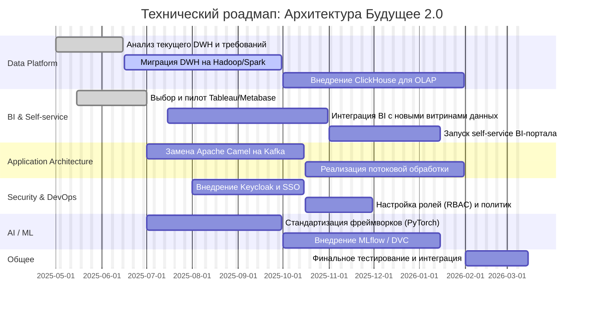

# Технический радар, роадмап изменений и обоснование

### 1. **Технический радар**

Технический радар разбит на четыре зоны зрелости технологий:

* **Adopt** — Технологии, принятые к широкому использованию.
* **Trial** — Пилотируемые решения в рамках отдельных команд или сервисов.
* **Assess** — Технологии, подлежащие оценке на возможность внедрения.
* **Hold** — Устаревшие или неприемлемые технологии, использование которых должно быть прекращено.

#### **Категории:**

* **Data & Analytics**
* **Infrastructure**
* **Security & DevOps**
* **Application & Integration**

| Категория                     | Технология / Методология      | Статус | Назначение / Комментарий                           |
| ----------------------------- | ----------------------------- | ------ | -------------------------------------------------- |
| **Data & Analytics**          | Hadoop + Spark                | Adopt  | Массивная обработка данных, замена устаревшего DWH |
|                               | PostgreSQL                    | Adopt  | Новая СУБД для OLTP-сценариев                      |
|                               | ClickHouse                    | Trial  | Быстрые OLAP-запросы и аналитика                   |
|                               | Snowflake                     | Assess | Расширяемый облачный DWH                           |
|                               | Power BI                      | Hold   | Устаревший BI-инструмент, плохо масштабируется     |
|                               | Tableau / Metabase            | Adopt  | BI-платформа нового поколения                      |
| **Application & Integration** | Apache Kafka                  | Adopt  | Шина данных, потоковая обработка                   |
|                               | Apache Camel                  | Hold   | Устарела, не поддерживает современные нагрузки     |
|                               | GraphQL                       | Assess | Альтернатива REST, гибкость API                    |
|                               | REST API + Gateway            | Adopt  | Стандартизованный способ интеграции                |
| **Security & DevOps**         | Keycloak                      | Trial  | IAM, OAuth2, SSO                                   |
|                               | Kubernetes                    | Assess | Автоматизация деплоя и масштабирования             |
|                               | Docker                        | Adopt  | Контейнеризация приложений                         |
|                               | GitLab CI/CD                  | Adopt  | Автоматизация сборок и деплоя                      |
| **ML & AI**                   | Python + PyTorch / TensorFlow | Adopt  | Обработка изображений, NLP, рекомендации           |
|                               | MLFlow / DVC                  | Assess | Управление ML-экспериментами и данными             |

---

### 2. **Роадмап изменений архитектуры (Q3 2025 – Q4 2026)**

Роадмап представляет поэтапную модернизацию технологического ландшафта, с привязкой к командам, срокам и ожидаемым результатам.

#### Гантт-диаграмма (Mermaid)

---

### 3. **Обоснование изменений по этапам**

#### Этап 1: Миграция DWH

* **Зачем**: SQL Server 2008 не масштабируется под растущий объём данных.
* **Результат**: Высокопроизводительное, горизонтально масштабируемое хранилище.

#### Этап 2: Внедрение потоковой интеграции (Kafka)

* **Зачем**: Camel не поддерживает обработку в реальном времени, не масштабируется горизонтально.
* **Результат**: Потоковые сценарии между сервисами и аналитикой, near real-time витрины.

#### Этап 3: BI и self-service аналитика

* **Зачем**: Существующий BI не предоставляет интерактивность и визуальную гибкость.
* **Результат**: Портал для бизнес-пользователей, возможность построения собственных отчётов.

#### Этап 4: Безопасность и IAM

* **Зачем**: Необходим единый вход и разграничение доступа (особенно между доменами).
* **Результат**: Centralized SSO + RBAC через Keycloak.

#### Этап 5: Развитие ИИ и MLOps

* **Зачем**: Разрозненные ИИ-решения сложно повторно использовать и масштабировать.
* **Результат**: Централизованное управление жизненным циклом ML-моделей (обучение → выкладка → аудит).

#### Этап 6: Интеграция с внешними бизнесами

* **Зачем**: Расширение сервисов — лаборатории, аптеки.
* **Результат**: Комплексная медицинская экосистема.

---

### Общий результат внедрения

| Изменение               | Эффект для компании                                                  |
| ----------------------- | -------------------------------------------------------------------- |
| Современный DWH + Spark | Ускорение расчётов, снижение затрат на поддержку, отказоустойчивость |
| Kafka как шина          | Реактивные сервисы, горизонтальное масштабирование                   |
| BI-портал               | Повышение независимости аналитиков и бизнес-пользователей            |
| Keycloak + RBAC         | Повышенная безопасность и соответствие нормам GDPR/HIPAA             |
| Единый стек ML          | Упрощение сопровождения, ускорение экспериментов                     |